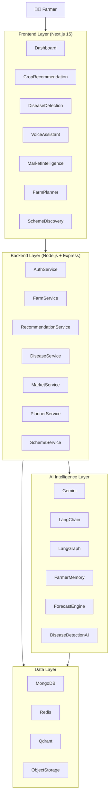
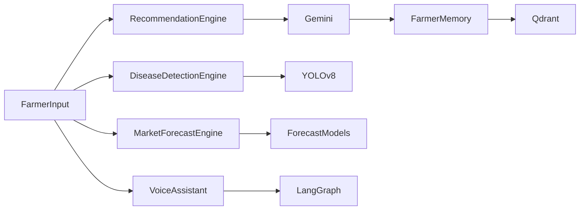
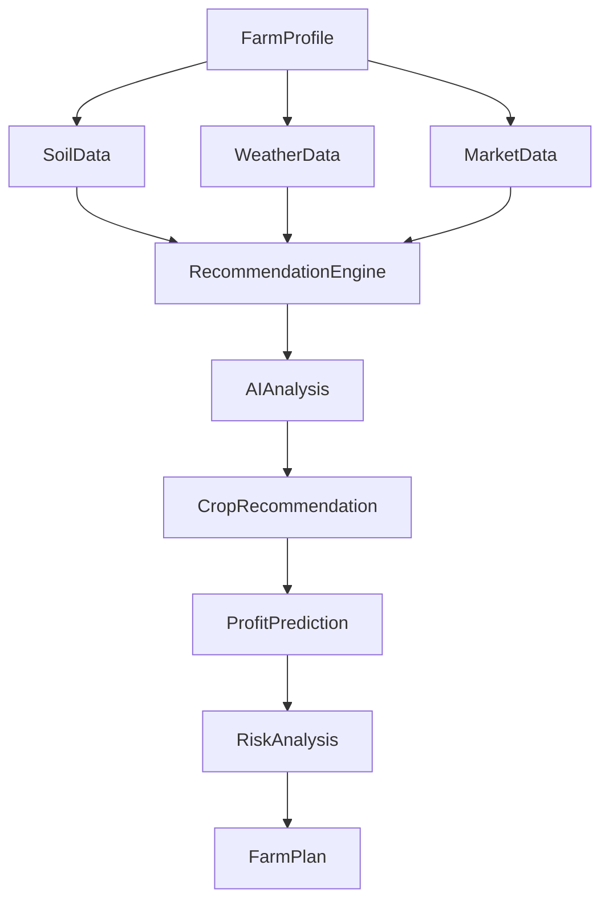
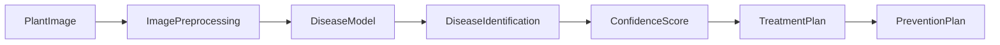
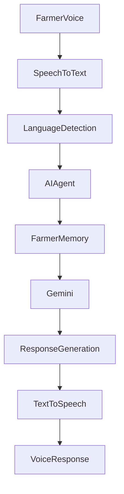
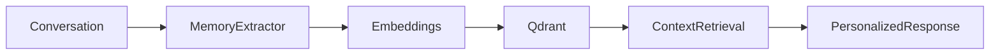
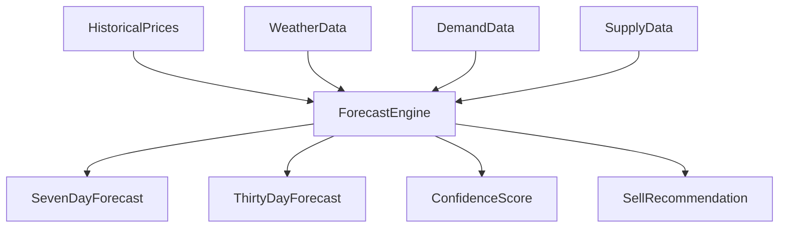
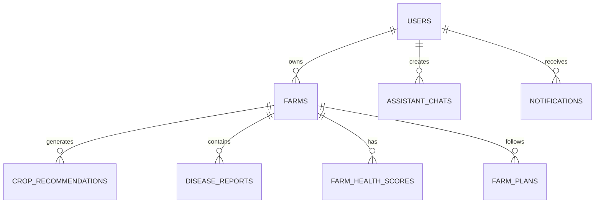

# 🌾 Vayukrishi

## Predict. Protect. Prosper.

> An AI-Powered Agricultural Decision Intelligence Platform that helps farmers make smarter decisions through Crop Intelligence, Disease Detection, Voice AI, Market Forecasting, Farm Health Analytics, and Personalized Agricultural Intelligence.

---

<p align="center">
🚜 AI Crop Recommendation • 📸 Disease Detection • 🎙️ Voice AI<br>
📈 Market Forecasting • 🧠 Farmer Memory • 🌱 Farm Health Intelligence<br>
🌍 Multilingual Agriculture Platform
</p>

---

# 🌍 The Problem

Every season, millions of farmers make decisions worth thousands of dollars with limited access to:

- Agricultural experts
- Disease specialists
- Market intelligence
- Localized recommendations
- Government schemes
- Data-driven planning

A single wrong decision can result in:

- Crop Failure
- Water Wastage
- Lower Yield
- Financial Loss
- Missed Subsidies
- Poor Market Timing

---

# 💡 The Vision

Imagine a farmer saying:

> "I have 2 acres in Nagpur with black soil. What should I grow this season?"

And instantly receiving:

```text
Recommended Crop: Soybean

Expected Profit: ₹85,000
Risk Level: Medium
Confidence: 92%

Reason:
✓ Soil compatibility
✓ Weather forecast
✓ Market demand
✓ Regional success rate
```

Vayukrishi transforms raw agricultural data into actionable decisions.

---

# 🚀 Why Vayukrishi Is Different

Most agricultural apps provide:

```text
Weather
+
Market Prices
+
Static Information
```

Vayukrishi provides:

```text
Weather Intelligence
+
Disease Intelligence
+
Market Intelligence
+
Voice AI
+
Farmer Memory
+
Predictive Analytics
+
Decision Intelligence
```

---

# 🏗️ System Architecture



---

# 🧠 AI Intelligence Layer



---

# 🌱 AI Crop Recommendation Engine

### Inputs

- Location
- Soil Type
- Land Size
- Water Availability
- Season

### Outputs

- Recommended Crops
- Yield Prediction
- Profit Estimation
- Risk Analysis
- AI Reasoning
- Farm Plan



---

# 📸 Disease Detection Intelligence



---

# 🎙️ Multilingual Voice AI Assistant

Supported Languages:

- English
- Marathi
- Hindi
- Gujarati
- Tamil
- Kannada



---

# 🧠 Farmer Memory System



---

# 📈 Market Forecasting Engine



---

# 🗄️ Database Architecture



---

# ⚡ Tech Stack

## Frontend
- Next.js 15
- React 19
- TypeScript
- Tailwind CSS v4
- shadcn/ui
- Zustand
- TanStack Query
- Framer Motion
- next-intl
- Recharts

## Backend
- Node.js
- Express.js
- MongoDB
- Redis

## AI
- Gemini
- LangChain
- LangGraph
- Qdrant

## Voice
- Whisper
- Deepgram

## Computer Vision
- YOLOv8
- EfficientNet

---


# 🌾 Vayukrishi

## Predict. Protect. Prosper.

> Turning agricultural data into intelligent decisions and intelligent decisions into better harvests.
